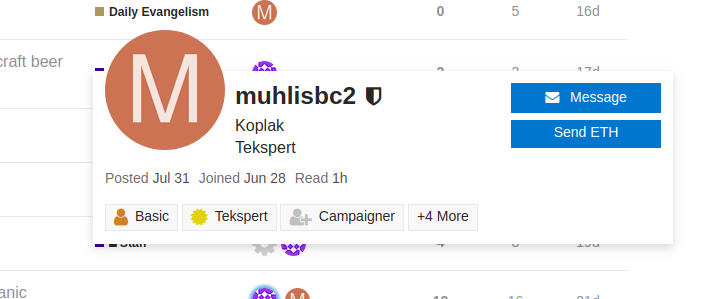
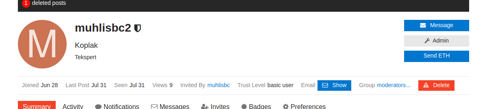
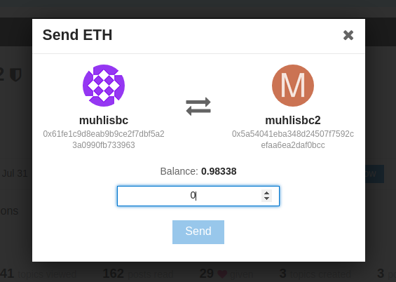
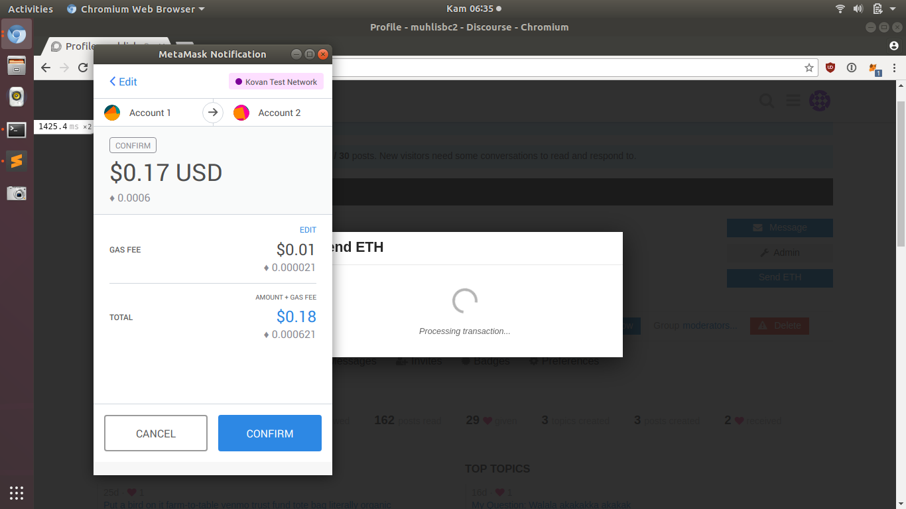
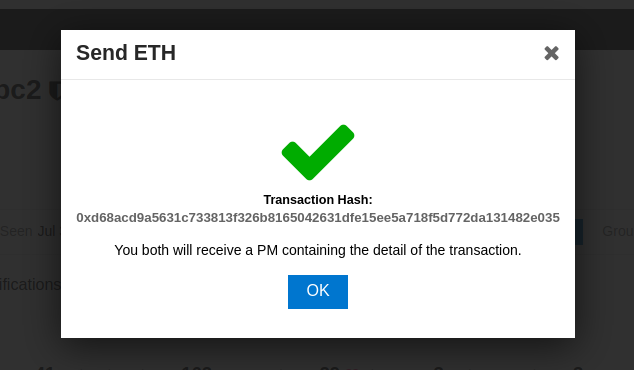
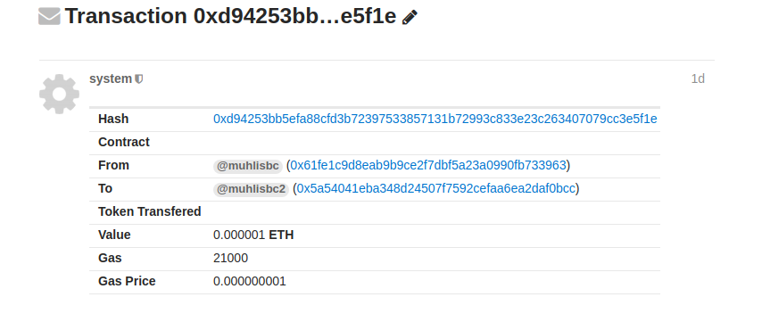
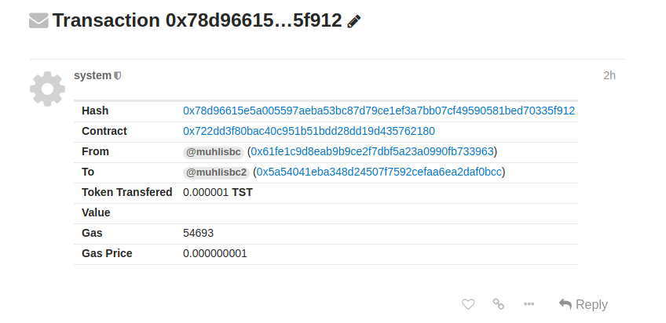

# discourse-ethereum

## Requirements

[MetaMask](https://metamask.io/) installed on your browser.

## Screenshot
### 'Send ETH' Button

### 'Send ETH' Modal

### PM
PM containing the transaction details sent by `system` to both user:

#### Transfer ETH

#### Transfer ERC20 Token

